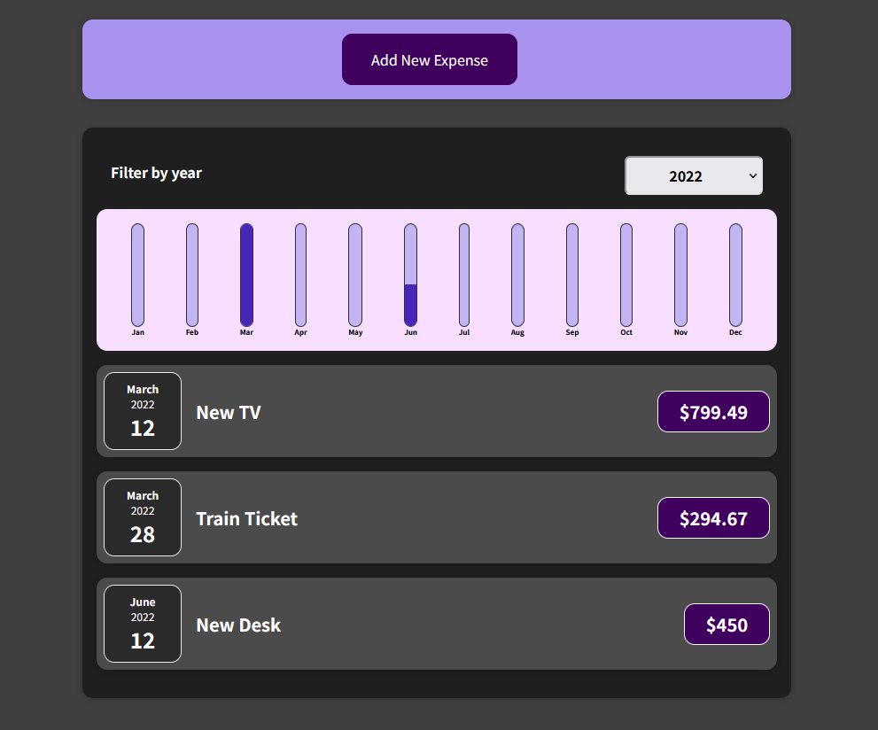
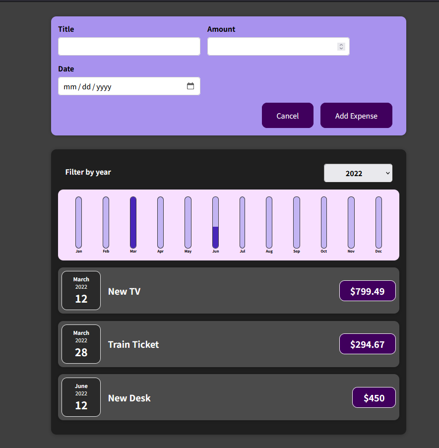

# Expense Tracker
 
The Expense Tracker is a tool designed to help users keep track of their expenses. It allows users to record their expenses and provides features to filter expenses by year. Additionally, users can easily add new expenses to the tracker.

